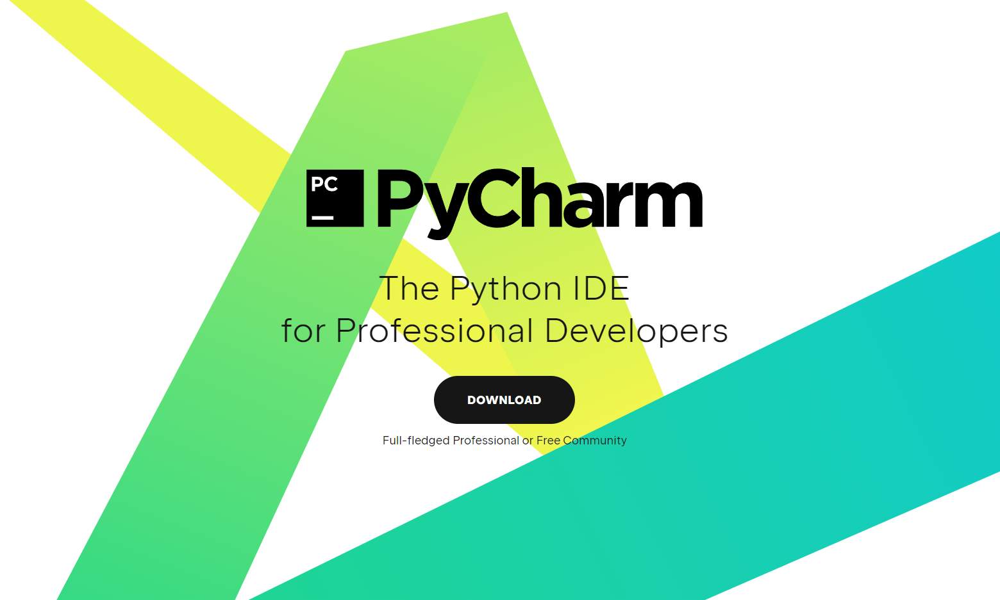
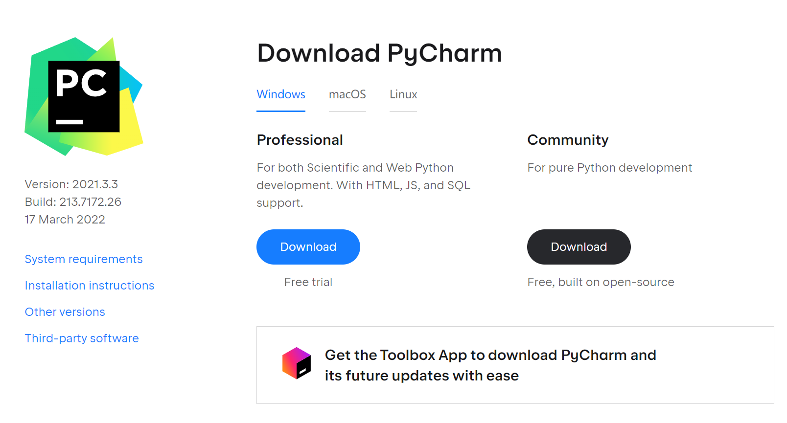
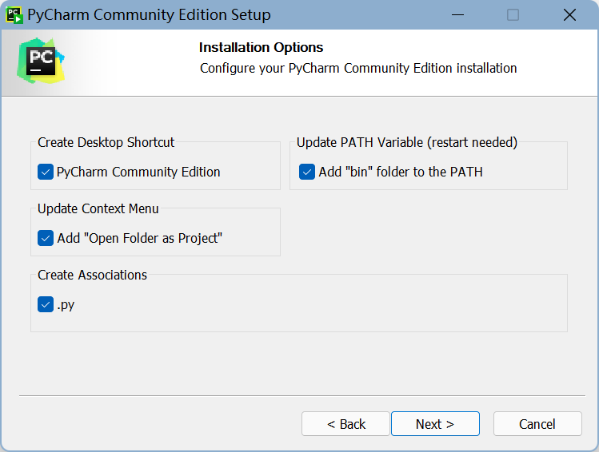
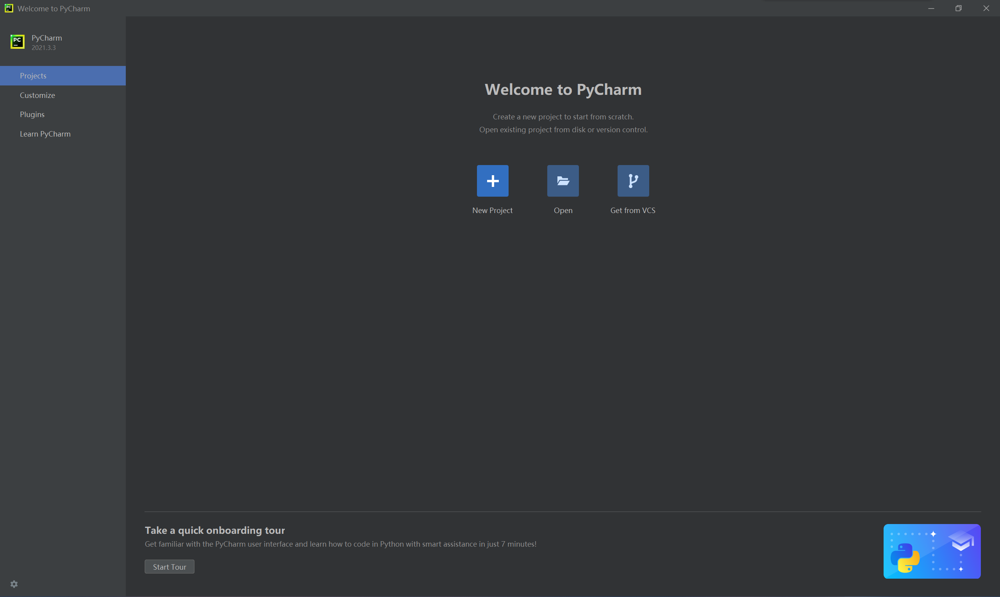
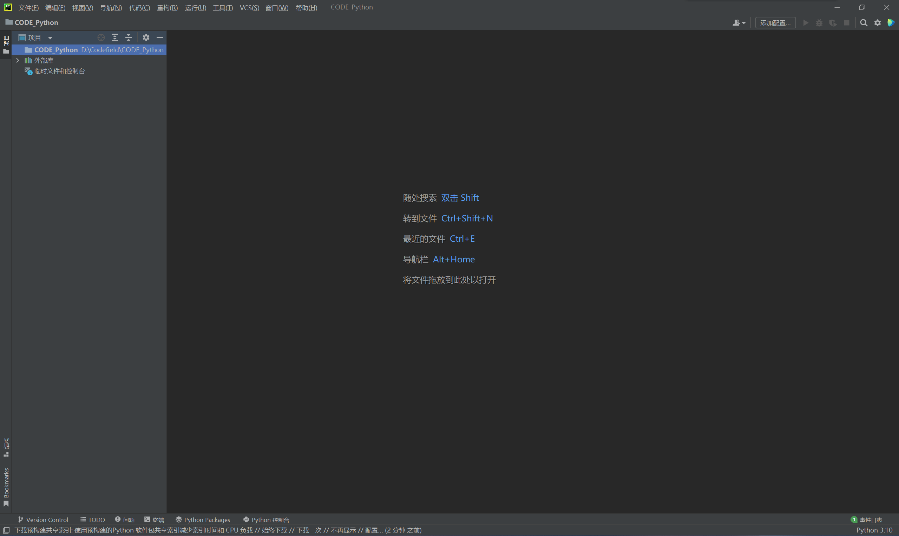
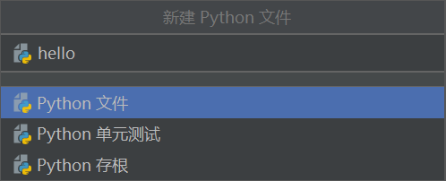
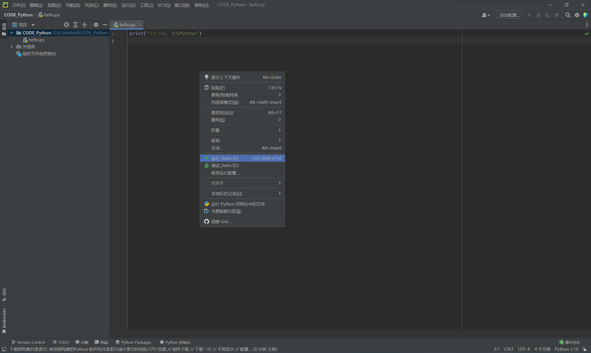
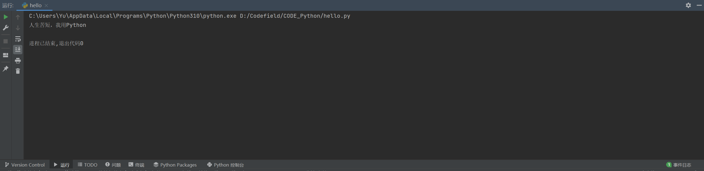

## Python 环境搭建

本章节将向大家介绍如何在本地搭建 Python3 开发环境。

Python3 可应用于多平台包括 Windows、Linux 和 Mac OS X。

---
## Python 下载
[Python官网]( https://www.python.org/downloads/windows/)

找到最新的Python 3版本，并下载

也就是这个

下载完成后打开exe文件

一定要勾选`Add Python 3.10 to PATH`

然后选择

之后一路点确定，到这个界面直接点close就行

同时按`WIN+R`键，输入`cmd`跳出命令提示符，输入`python`

出现上述字样即为安装成功

如果没有出现上述字样，很有可能实在安装过程中没有勾选`Add Python 3.10 to PATH`，建议重新安装并勾选

也可以在开始菜单中搜索 IDLE：

之后我们就可以在IDLE中开始python之旅

当然这看起来并不够酷
在日常开发中，程序员更多使用的是集成开发环境（IDE：Integrated Development Environment），比如**PyCharm**

**PyCharm** 是由 JetBrains 打造的一款 Python IDE，支持 macOS、 Windows、 Linux 系统。

**PyCharm** 功能 : 调试、语法高亮、Project管理、代码跳转、智能提示、自动完成、单元测试、版本控制……

**PyCharm** 下载地址 : https://www.jetbrains.com/pycharm/download/

**Professional**（专业版，收费）：完整的功能，可试用 30 天。

**Community**（社区版，免费）：阉割版的专业版。

社区版就可以满足我们绝大部分的开发需求，当然如果你是高校学生，也可以用学生邮箱申请专业版免费使用。

点击Download,下载完成后打开exe安装程序，选择安装路径，我这里选的是D盘

点击Next

会出现如下画面，把所有都勾选上即可

然后一直下一步即可，完成后重启电脑

PyCharm界面

默认都是英文，安装 PyCharm 中文插件，打开菜单栏 File，选择 Settings，然后选 Plugins，点 Marketplace，搜索 chinese，然后点击 install 安装：

重启IDE以后就变成中文了

现在点击新建项目

选择自己想要存放代码的位置，其余设置参考上图。

现在项目就创建成功了

右键文件夹->新建->Python文件

上面是文件名，点击Python文件，回车，就新建完成了:

接下来就可以在这个界面上编写你的程序了

写完后右击代码空白区域，点击run运行程序:

在下面的黑框框处就会出现运行结果

或者用快捷键`Ctrl+Shift+F10`也是同样的效果

至此，你可以愉快的使用pycharm来学习python啦！欢迎加入python！
